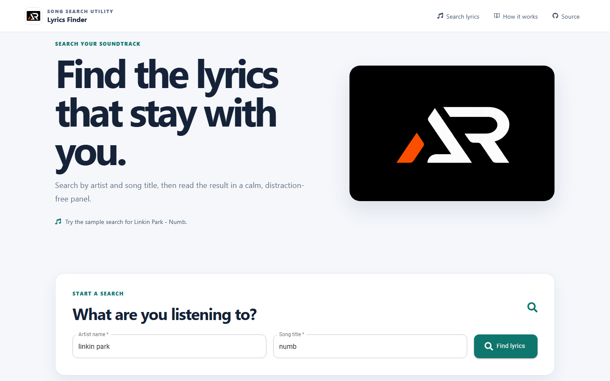

# Lyrics Finder

A responsive React app for searching and reading song lyrics by artist and title through the lyrics.ovh API.

## Features

- Search lyrics by artist and song title
- Sample search loaded on first visit
- Clear loading, success and error feedback
- Responsive fixed header with mobile navigation
- Focused reading panel, icon-only footer links and go-to-top control

## Tech stack

React, Create React App, Material UI, Sass, Axios and React Icons.

## Run locally

    npm install
    npm start

Create a production build with npm run build.

## Deployment

Live demo: [a2rp.github.io/lyrics-finder](https://a2rp.github.io/lyrics-finder/)

## Future improvements

The app can be extended with saved searches, artist artwork and a song history panel.

## Links

- Portfolio: [https://www.ashishranjan.net](https://www.ashishranjan.net)
- GitHub: [https://github.com/a2rp](https://github.com/a2rp)
- CodePen: [https://codepen.io/ash1198](https://codepen.io/ash1198)
- LinkedIn: [https://www.linkedin.com/in/aashishranjan](https://www.linkedin.com/in/aashishranjan)
- Facebook: [https://www.facebook.com/theash.ashish/](https://www.facebook.com/theash.ashish/)
- YouTube: [https://www.youtube.com/@ashishranjan-ashz?sub_confirmation=1](https://www.youtube.com/@ashishranjan-ashz?sub_confirmation=1)
- Email: [ash.ranjan09@gmail.com](mailto:ash.ranjan09@gmail.com)

## Support

- Support: [https://a2rp-donation-page.netlify.app/](https://a2rp-donation-page.netlify.app/)
- Buy Me a Coffee: [https://buymeacoffee.com/a2rp](https://buymeacoffee.com/a2rp)
- Patreon: [https://patreon.com/a2rp](https://patreon.com/a2rp)
